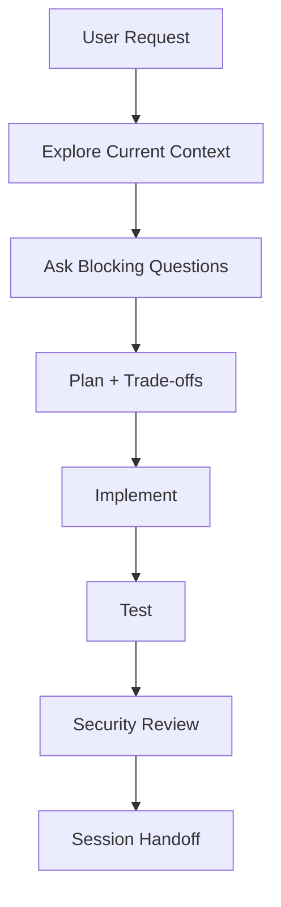

# GROUP1 Agent Instructions

This repository contains a 3-layer ASP.NET Core MVC assignment:

- `MVC/`: ASP.NET Core MVC presentation layer (Controllers, Views, ViewModels, Middlewares).
- `DataAccessLayer/`: EF Core, Entities, Generic Repository, and Unit of Work patterns.
- `ServiceLayer/`: Business logic, DTOs, and Service interfaces.

Treat this project as a production-grade learning project.

## Operating Rules

- Respond at a senior software engineer level. Be direct, precise, and implementation-focused.
- Before coding, inspect the current source, identify the affected boundaries, and ask only blocking questions that cannot be answered from the repository.
- When the user proposes an implementation method, explain the implementation flow and provide a trade-off table focused on scalability, maintainability, security, performance, and user experience.
- Use Mermaid for useful architecture, SDLC, or data-flow diagrams.
- Keep changes scoped. Do not add unrelated refactors, dependencies, or generated churn.
- Never initialize Git, add `.gitignore`, or perform destructive source-control actions unless the user explicitly requests it.

## SDLC Workflow

Follow this loop for every meaningful change:

1. Clarify the requirement and acceptance criteria.
2. Inspect the current implementation and dependency graph.
3. Brainstorm the plan, alternatives, trade-offs, and risks.
4. Implement a small vertical change.
5. Add or update unit, integration, and UI tests according to risk.
6. Run build and tests where feasible.
7. Review security, privacy, performance, and maintainability.
8. Update handoff context before push or session end.

## Architecture Rules

- Maintain the 3-layer architecture cleanly: MVC (Presentation), ServiceLayer (Business Logic), and DataAccessLayer (Data Access). Keep dependencies unidirectional: MVC depends on ServiceLayer, ServiceLayer depends on DataAccessLayer.
- Use ASP.NET Core built-in dependency injection, configuration, authentication, authorization, antiforgery, validation, logging, and options patterns.
- Keep controllers thin. Move all business logic into services in the ServiceLayer.
- Use Unit of Work (`IUnitOfWork`) and Generic Repository (`IRepository<T>`) patterns for data access abstraction inside the DataAccessLayer.
- Use EF Core async APIs for data access. Avoid blocking on async calls.
- Use view models/input models for UI boundaries (MVC view models) and DTOs for service communication. Do not bind EF entities directly to forms that accept user input.

## Code Convention

- Enable and respect nullable reference types.
- Prefer explicit, intention-revealing names over abbreviations.
- Apply SOLID, KISS, and DRY pragmatically:
  - SOLID: keep dependencies explicit and interfaces useful, not ornamental.
  - KISS: choose the simplest design that satisfies current requirements.
  - DRY: remove meaningful duplication, but do not abstract two examples prematurely.
- Keep methods short enough to review easily. Extract helpers when they reduce cognitive load.
- Use guard clauses for invalid state and validation failures.
- Do not swallow exceptions. Log actionable context without secrets or PII.

## Security Rules

- Never hardcode production secrets, passwords, tokens, API keys, connection strings with credentials, or personal data.
- Development-safe LocalDB connection strings are allowed in `appsettings.Development.json`; production values must come from user secrets, environment variables, or deployment secrets.
- Use ASP.NET Core Identity for local account authentication.
- Call `UseAuthentication()` before `UseAuthorization()`.
- Use authorization attributes or policies for protected routes and pages.
- Keep CSRF protection enabled for form posts.
- Rely on Razor HTML encoding. Do not use raw HTML rendering unless the input is trusted and documented.
- Use EF Core parameterized queries or LINQ. Avoid string-concatenated SQL.
- Do not log passwords, tokens, cookies, raw connection strings, reset links, or PII.
- Before handoff, scan changed files for obvious secrets and PII.

## Testing Rules

- Use xUnit for unit and integration tests.
- Use `WebApplicationFactory` for ASP.NET Core integration tests.
- Use Playwright for browser UI tests.
- Cover authentication basics: home page, register/login/logout navigation, protected endpoint/page behavior, health endpoint.
- Tests must be deterministic. Use separate database environments or in-memory providers where appropriate.
- If a verification step cannot run, state the exact command attempted and the blocker.

## Context Handoff

Before push, session handoff, or a new AI session, summarize:

- Goal and status.
- Files and subsystems changed.
- Key decisions and trade-offs.
- Commands run and results.
- Known risks, skipped tests, and next actions.

## Tool-Specific Notes

- Codex should read this `AGENTS.md` as the canonical source.
- Claude Code should use `CLAUDE.md`, which imports this file.
- GitHub Copilot should use `.github/copilot-instructions.md` and path-specific instructions.
- Antigravity should use `.agents/rules` and `.agents/skills`.

