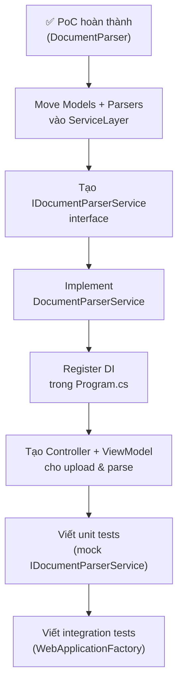

# Hướng dẫn Leader — DocumentParser PoC

> **Mục tiêu tài liệu này**: Giúp Leader hiểu nhanh dự án `DocumentParser`,
> chạy thử trong 5 phút, đọc output đúng, và ra quyết định tích hợp vào hệ thống chính.

---

## Mục lục

1. [Tổng quan](#1-tổng-quan)
2. [Yêu cầu môi trường](#2-yêu-cầu-môi-trường)
3. [Cài đặt & Chạy lần đầu](#3-cài-đặt--chạy-lần-đầu)
4. [Đọc hiểu output](#4-đọc-hiểu-output)
5. [Dùng parser với file của bạn](#5-dùng-parser-với-file-của-bạn)
6. [Dùng parser trong code C#](#6-dùng-parser-trong-code-c)
7. [Cấu trúc project](#7-cấu-trúc-project)
8. [Giới hạn kỹ thuật (Limitations)](#8-giới-hạn-kỹ-thuật-limitations)
9. [Lộ trình tích hợp vào MVC](#9-lộ-trình-tích-hợp-vào-mvc)
10. [Câu hỏi thường gặp](#10-câu-hỏi-thường-gặp)

---

## 1. Tổng quan

`DocumentParser` là **console app proof-of-concept** kiểm chứng hai thư viện
đọc tài liệu trước khi tích hợp vào layer `ServiceLayer` của dự án chính.

```
┌──────────────────────────────────────────────────────┐
│              DocumentParser Console App               │
│                                                       │
│  ┌─────────────────┐      ┌──────────────────────┐   │
│  │   PdfParser.cs  │      │   DocxParser.cs       │   │
│  │  (iText7 9.1)   │      │ (Open XML SDK 3.3)    │   │
│  └────────┬────────┘      └──────────┬───────────┘   │
│           │                          │                │
│           └──────────┬───────────────┘                │
│                      ▼                                │
│              ParseResult / ParsedPage                 │
│           (page number + text content)                │
└──────────────────────────────────────────────────────┘
```

| Thư viện | Version | License | Dùng cho |
|----------|---------|---------|----------|
| **iText7** | 9.1.0 | AGPL-3.0 ⚠️ | Parse PDF (text layer) |
| **itext7.bouncy-castle-adapter** | 9.1.0 | AGPL-3.0 | Bắt buộc đi kèm iText7 9.x |
| **DocumentFormat.OpenXml** | 3.3.0 | MIT ✅ | Parse DOCX |
| **Tesseract** | 5.2.0 | Apache-2.0 ✅ | OCR cho PDF ảnh/scan |
| **PDFtoImage** | 5.2.1 | MIT ✅ | Render PDF→ảnh để đưa vào OCR |

> ⚠️ **Lưu ý license iText7**: Community edition dùng **AGPL-3.0**.
> Nếu app phân phối dạng closed-source thì cần mua commercial license.
> Xem thêm ở [mục 8](#8-giới-hạn-kỹ-thuật-limitations).

---

## 2. Yêu cầu môi trường

| Thứ cần có | Phiên bản tối thiểu | Kiểm tra bằng lệnh |
|-----------|---------------------|--------------------|
| .NET SDK | **10.0** | `dotnet --version` |
| Kết nối internet | Lần đầu restore NuGet | — |
| RAM trống | ~200 MB | — |

> Không cần cài thêm Word, Adobe Reader hay bất kỳ phần mềm nào khác.

---

## 3. Cài đặt & Chạy lần đầu

### Bước 1 — Mở terminal, vào thư mục dự án

```bash
cd "E:\FPTU\Semester-7\PRN222\Assignment1\MVC\DocumentParser"
```

### Bước 2 — Chạy app

```bash
dotnet run -c Release
```

> Lần đầu chạy sẽ tự động:
> - Restore NuGet packages (cần internet ~30 giây)
> - Sinh 4 file mẫu vào `bin/Release/net10.0/SampleFiles/`
> - Parse 3 PDF + 1 DOCX
> - In kết quả ra console

### Hoặc chạy từ thư mục gốc solution

```bash
cd "E:\FPTU\Semester-7\PRN222\Assignment1\MVC"
dotnet run --project DocumentParser/DocumentParser.csproj -c Release
```

### Output kỳ vọng (tóm tắt)

```
════════════════════════════════════════════════════════════════════════
  STEP 1 — Generating sample files
════════════════════════════════════════════════════════════════════════
  [PDF] Created: sample1_text.pdf
  [PDF] Created: sample2_multipage.pdf
  [PDF] Created: sample3_scanned_sim.pdf
  [DOCX] Created: sample.docx

════════════════════════════════════════════════════════════════════════
  STEP 2 — Parsing PDFs with iText7
════════════════════════════════════════════════════════════════════════

  ┌─ sample1_text.pdf  [PDF-text]
  │  Total pages   : 1
  │  Non-empty     : 1
  │  Page  1: Sample PDF 1 — Plain Text...

  ┌─ sample2_multipage.pdf  [PDF-text]
  │  Total pages   : 3
  │  Non-empty     : 3
  │  Page  1: Page 1 of 3 — Multi-Page PDF...
  │  Page  2: Page 2 of 3 — Multi-Page PDF...
  │  Page  3: Page 3 of 3 — Multi-Page PDF...

  ┌─ sample3_scanned_sim.pdf  [PDF-scanned]
  │  Total pages   : 2
  │  Non-empty     : 1
  │  ⚠ Warnings (2):
  │    • Page 1 yielded no text. The PDF may be image-based (scanned)...
  │  Page  1: (no extractable text)  [EMPTY — no extractable text]
  │  Page  2: Page 2 — Text layer present...

════════════════════════════════════════════════════════════════════════
  STEP 3 — Parsing DOCX with Open XML SDK
════════════════════════════════════════════════════════════════════════

  ┌─ sample.docx  [DOCX]
  │  Total pages   : 3
  │  Non-empty     : 3
  │  Page  1: Section 1 — Introduction (Page 1)...
  │  Page  2: Section 2 — Details (Page 2)...
  │  Page  3: Section 3 — Conclusion (Page 3)...

✅  All parsing demos completed successfully.
```

---

## 4. Đọc hiểu output

### 4.1 Cấu trúc một block kết quả

```
  ┌─ <tên file>  [<format>]
  │  Total pages   : <tổng số trang>
  │  Non-empty     : <số trang có text>
  │  ⚠ Warnings    : <cảnh báo nếu có>
  │
  │  Page  1: <120 ký tự đầu của trang>
  │  Page  2: ...
  └─ end of <tên file>
```

### 4.2 Các giá trị Format

| Format | Ý nghĩa |
|--------|---------|
| `PDF-text` | PDF có text layer — extract thành công |
| `PDF-scanned` | Trang đầu trả về rỗng — có thể là PDF scan |
| `DOCX` | File Word 2007+ |

### 4.3 Cảnh báo quan trọng cần chú ý

| Cảnh báo | Việc cần làm |
|----------|-------------|
| `Page X yielded no text` | File PDF này là ảnh scan, cần OCR (Tesseract) |
| `No explicit page-break elements found` | DOCX không có page break rõ ràng — toàn bộ nội dung coi là 1 trang |
| `X/Y pages returned no text` | Một số trang chứa ảnh hoặc font không hỗ trợ |

---

## 5. Dùng parser với file của bạn

### 5.1 Test nhanh với file PDF thật

Chỉnh sửa `Program.cs`, thay đường dẫn file mẫu bằng file thật:

```csharp
// Dòng 22–27 trong Program.cs — thay bằng file của bạn:
var pdfFiles = new[]
{
    @"C:\Users\YourName\Documents\report.pdf",
    @"C:\Users\YourName\Documents\scan.pdf",
    Path.Combine(sampleDir, "sample2_multipage.pdf"),  // giữ 1 mẫu để so sánh
};
```

Sau đó chạy lại:

```bash
dotnet run -c Release
```

### 5.2 Test nhanh với file DOCX thật

```csharp
// Dòng 39 trong Program.cs:
ParseResult docxResult = docxParser.Parse(@"C:\Users\YourName\Documents\thesis.docx");
```

### 5.3 Đọc 1 file bất kỳ + OCR (single-file mode)

Cách nhanh nhất để test 1 file — in **toàn bộ** text từng trang + kết luận OCR:

```bash
dotnet run -- "C:\duong-dan\toi-file\hoa-don-scan.pdf"
```

App sẽ:
1. Thử đọc text layer trước (nhanh, chính xác)
2. Trang nào rỗng (ảnh/scan) → render thành ảnh → đưa qua OCR (Tesseract vie+eng)
3. In kết quả + đánh dấu trang nào dùng OCR (`[via OCR]`)

Ví dụ output thực tế (file hóa đơn scan tiếng Việt):

```
  File   : hoa-don-scan.pdf
  Format : PDF-ocr
  OCR    : ENABLED (vie+eng)
  Pages  : 1 total, 1 with text

  PAGE 1  [via OCR]
  ────────────────────────────────────────
  TRAM 247 - CN THỦ ĐỨC
  HOÁ ĐƠN THANH TOÁN
  Số HĐ: 271413
  ...

  ✅ VERDICT: OCR WORKS. Recovered text from 1/1 image page(s) using vie+eng.
```

---

## 6. Dùng parser trong code C#

Đây là API công khai để tích hợp vào `ServiceLayer` sau này.

### 6.1 Parse PDF

```csharp
using DocumentParser.Parsers;

var parser = new PdfParser();
ParseResult result = parser.Parse("path/to/file.pdf");

// Kiểm tra có warnings không
if (result.Warnings.Count > 0)
{
    foreach (var warning in result.Warnings)
        Console.WriteLine($"⚠ {warning}");
}

// Duyệt từng trang (page number bắt đầu từ 1)
foreach (var page in result.Pages)
{
    Console.WriteLine($"--- Trang {page.PageNumber} ---");
    
    if (page.IsEmpty)
    {
        Console.WriteLine("(Trang trắng hoặc ảnh scan — không có text)");
        continue;
    }
    
    Console.WriteLine(page.Text);
}

// Truy cập trang cụ thể (index = pageNumber - 1)
string trang2 = result.Pages[1].Text;  // Trang số 2
```

### 6.2 Parse DOCX

```csharp
using DocumentParser.Parsers;

var parser = new DocxParser();
ParseResult result = parser.Parse("path/to/file.docx");

foreach (var page in result.Pages)
{
    Console.WriteLine($"=== Trang {page.PageNumber} ===");
    Console.WriteLine(page.Text);
}
```

### 6.3 Model dữ liệu trả về

```csharp
// ParseResult — aggregate của toàn bộ document
public class ParseResult
{
    string SourceFile    // tên file (không có đường dẫn)
    string Format        // "PDF-text" | "PDF-scanned" | "DOCX"
    int    TotalPages    // tổng số trang
    int    NonEmptyPages // số trang có nội dung
    IReadOnlyList<ParsedPage> Pages    // danh sách trang
    IReadOnlyList<string>     Warnings // cảnh báo (nếu có)
}

// ParsedPage — một trang
public record ParsedPage(
    int    PageNumber,  // số trang (1-based)
    string Text,        // toàn bộ text đã normalize
    bool   IsEmpty      // true nếu không extract được gì
)
{
    string Preview  // 120 ký tự đầu, dùng để log/preview
}
```

---

## 7. Cấu trúc project

```
DocumentParser/
│
├── Models/
│   └── ParsedPage.cs           ← Data model: ParsedPage + ParseResult
│
├── Parsers/
│   ├── PdfParser.cs            ← iText7: extract text + OCR fallback cho trang ảnh
│   └── DocxParser.cs           ← Open XML SDK: walk paragraph/table, detect page break
│
├── Ocr/                        ← Tích hợp OCR
│   ├── IOcrEngine.cs           ← Interface (đổi engine không sửa parser)
│   ├── TesseractOcrEngine.cs   ← Tesseract (vie+eng)
│   └── PdfPageRasterizer.cs    ← Render PDF→ảnh (PDFtoImage/PDFium)
│
├── tessdata/                   ← Language data: eng + vie (copy vào output)
│
├── Generators/                 ← Chỉ dùng để tạo sample file — KHÔNG phải parser
│   ├── PdfSampleGenerator.cs   ← Tạo 3 file PDF mẫu (chỉ import iText7)
│   ├── DocxSampleGenerator.cs  ← Tạo 1 file DOCX mẫu (chỉ import Open XML SDK)
│   └── SampleFileGenerator.cs  ← Coordinator gọi 2 generator trên
│
├── Program.cs                  ← Entry point: generate → parse → log → summary
├── DocumentParser.csproj       ← Package references
├── README.md                   ← Technical README (tiếng Anh, cho dev)
└── LEADER_GUIDE.md             ← Tài liệu này
```

> **Tại sao `PdfSampleGenerator` và `DocxSampleGenerator` lại tách thành 2 file?**
>
> Cả iText7 và Open XML SDK đều định nghĩa class có tên giống nhau:
> `Paragraph`, `Document`, `Table`, `Text`, `Path`…
> Nếu import cả hai vào 1 file, compiler báo lỗi CS0104 "ambiguous reference".
> Tách ra 2 file riêng biệt là cách giải quyết sạch nhất.

---

## 8. Giới hạn kỹ thuật (Limitations)

### PDF — iText7 (+ Tesseract OCR)

```
Vấn đề                    │ Mức độ   │ Giải pháp
──────────────────────────┼──────────┼──────────────────────────────────────
PDF scan (ảnh)            │ ✅ Đã xử lý│ OCR fallback (Tesseract vie+eng) — ĐÃ TÍCH HỢP
Độ chính xác OCR          │ 🟡 TB   │ Tăng DPI, dùng tessdata_best, tiền xử lý ảnh
License AGPL-3.0 (iText7) │ 🔴 Cao   │ Mua commercial license nếu closed-source
                          │          │ Hoặc dùng PdfPig (MIT, miễn phí)
Cột đôi / layout phức tạp │ 🟡 TB   │ Dùng LocationTextExtractionStrategy
Font đặc biệt (Type3/CID) │ 🟡 TB   │ Pre-process hoặc chấp nhận giới hạn
AcroForm fields           │ 🟡 TB   │ Xử lý riêng qua PdfAcroForm API
PDF có mật khẩu           │ 🟡 TB   │ Truyền password qua ReaderProperties
```

> ✅ **OCR đã được tích hợp**: `PdfParser` tự động đọc text layer trước; trang nào rỗng
> (ảnh/scan) sẽ được render thành ảnh 300 DPI rồi đưa qua Tesseract (vie+eng).
> Text từ OCR được đánh dấu `Source = Ocr` và có cảnh báo "lower-confidence".

### DOCX — Open XML SDK

```
Vấn đề                    │ Mức độ   │ Giải pháp
──────────────────────────┼──────────┼──────────────────────────────────────
Không có page boundary    │ 🔴 Cao   │ Aspose.Words (trả phí) hoặc chấp nhận
Text box / drawing        │ 🟡 TB   │ Walk AlternateContent thêm
Header / Footer           │ 🟡 TB   │ Đọc HeaderPart / FooterPart riêng
Footnote / Endnote        │ 🟡 TB   │ Đọc FootnotesPart riêng
File .doc (Word 97-2003)  │ 🔴 Cao   │ Yêu cầu user convert sang .docx
DOCX có mật khẩu          │ 🔴 Cao   │ Decrypt trước khi parse
```

### Quyết định về license iText7

```
Kịch bản sử dụng          │ Khuyến nghị
──────────────────────────┼──────────────────────────────────────────────
Học tập / internal tool   │ ✅ iText7 Community (AGPL-3.0) — OK
Open source app (GPL)     │ ✅ iText7 Community (AGPL-3.0) — OK
Closed-source / thương mại│ ❌ Cần mua iText commercial license
                          │    HOẶC thay bằng PdfPig (MIT, miễn phí)
```

---

## 9. Lộ trình tích hợp vào MVC

Khi PoC được duyệt, đây là các bước tiếp theo để tích hợp vào dự án chính:



### Bước 1 — Di chuyển code vào đúng layer

```
DocumentParser/Models/    → ServiceLayer/DTOs/
DocumentParser/Parsers/   → ServiceLayer/Services/
```

### Bước 2 — Tạo interface trong ServiceLayer

```csharp
// ServiceLayer/Interfaces/IDocumentParserService.cs
public interface IDocumentParserService
{
    Task<ParseResult> ParsePdfAsync(Stream fileStream, string fileName);
    Task<ParseResult> ParseDocxAsync(Stream fileStream, string fileName);
}
```

### Bước 3 — Tạo upload endpoint trong MVC

```csharp
// MVC/Controllers/DocumentController.cs
[HttpPost]
[ValidateAntiForgeryToken]
public async Task<IActionResult> Upload(IFormFile file)
{
    if (file is null || file.Length == 0)
        return BadRequest("File is empty.");

    using var stream = file.OpenReadStream();
    
    ParseResult result = file.ContentType == "application/pdf"
        ? await _documentParserService.ParsePdfAsync(stream, file.FileName)
        : await _documentParserService.ParseDocxAsync(stream, file.FileName);

    return View("Result", MapToViewModel(result));
}
```

### Bước 4 — Đăng ký DI (Program.cs)

```csharp
builder.Services.AddScoped<IDocumentParserService, DocumentParserService>();
```

---

## 10. Câu hỏi thường gặp

**Q: App không chạy được, báo lỗi `dotnet: command not found`?**
> Cần cài .NET SDK 10.0 từ https://dotnet.microsoft.com/download

**Q: Lần đầu chạy bị chậm (30–60 giây)?**
> Bình thường — NuGet đang download packages (~50MB). Từ lần 2 trở đi sẽ nhanh.

**Q: PDF của tôi bị trả về toàn trang trắng?**
> File đó là PDF scan (ảnh chụp). **OCR đã được tích hợp** nên app sẽ tự động đưa trang
> ảnh qua Tesseract. Nếu vẫn trắng: ảnh quá mờ / độ phân giải thấp → thử tăng DPI
> (tham số `ocrDpi` trong `PdfParser`, mặc định 300, thử 400–600).

**Q: OCR đọc sai vài chữ tiếng Việt?**
> Bình thường — OCR không bao giờ chính xác 100%, nhất là chữ có dấu hoặc scan mờ.
> App đã đánh dấu text OCR là "lower-confidence". Để cải thiện: tải `tessdata_best`
> (thay `tessdata_fast`), tăng DPI, hoặc tiền xử lý ảnh (khử nhiễu, tăng tương phản).

**Q: Tôi muốn thêm ngôn ngữ OCR khác (ví dụ tiếng Nhật)?**
> Tải file `jpn.traineddata` bỏ vào thư mục `tessdata/`, rồi đổi `languages: "vie+eng"`
> thành `"jpn+vie+eng"` khi tạo `TesseractOcrEngine`.

**Q: DOCX của tôi chỉ hiện 1 trang dù có nhiều trang?**
> Open XML SDK không phải rendering engine — nó không tính page break tự động.
> Chỉ detect được `<w:pageBreak>` explicit trong file. Nếu file do Word tự xuống dòng
> thì không có break element và toàn bộ được coi là 1 trang.

**Q: Tôi muốn đổi thư viện PDF từ iText7 sang PdfPig (MIT)?**
> Chỉ cần implement lại `PdfParser.cs` với PdfPig API.
> `ParseResult` và `ParsedPage` không cần thay đổi vì chúng là model trung lập.

**Q: File DOCX có password thì sao?**
> Hiện tại sẽ throw `InvalidDataException`. Cần decrypt trước.
> Có thể dùng thư viện `OfficeOpenXml` hoặc `Aspose.Words` để xử lý.

**Q: Có thể test với file PDF có 2 cột (multi-column)?**
> Được — nhưng thứ tự text có thể sai (đọc theo stream, không theo visual order).
> Nếu dự án cần multi-column accuracy, dùng `LocationTextExtractionStrategy`
> thay cho `SimpleTextExtractionStrategy` trong `PdfParser.cs`.

---

## Tóm tắt nhanh (TL;DR)

```bash
# Chạy ngay:
cd DocumentParser && dotnet run -c Release

# Kết quả kỳ vọng:
# - 3 PDF được parse, mỗi trang có page number + text
# - 1 DOCX được parse thành 3 trang
# - PDF scan → trang trống + warning (đúng behavior)
# - ✅  All parsing demos completed successfully.
```

| Quyết định cần Leader | Khuyến nghị |
|----------------------|-------------|
| Dùng iText7 hay PdfPig? | **PdfPig (MIT)** nếu là closed-source; iText7 nếu là internal/OSS |
| Xử lý PDF scan ra sao? | Tích hợp **Tesseract.NET** cho OCR — task riêng |
| Page number DOCX chính xác? | Chấp nhận explicit-break-only **hoặc** dùng Aspose.Words (trả phí) |
| Tích hợp vào layer nào? | `ServiceLayer/Services/` + interface `IDocumentParserService` |

---

*Tài liệu cập nhật: 2026-05-27 — Tác giả: Claude Code (AI assistant)*
