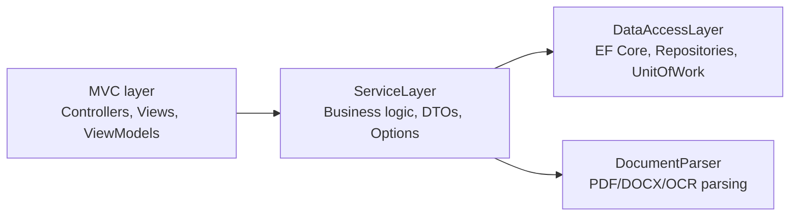
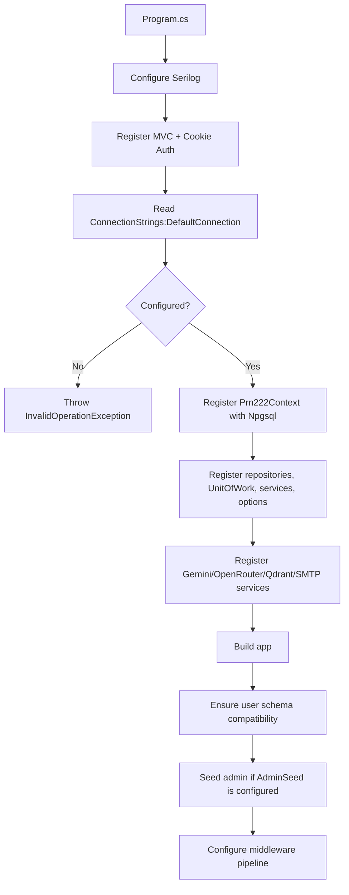
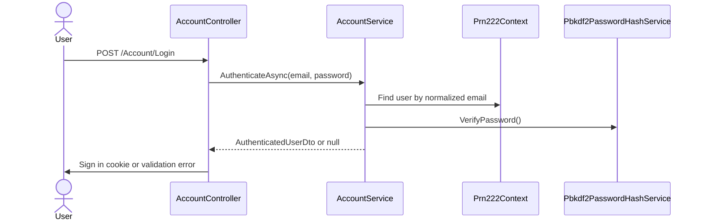
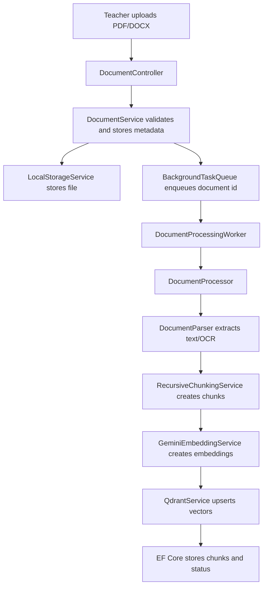
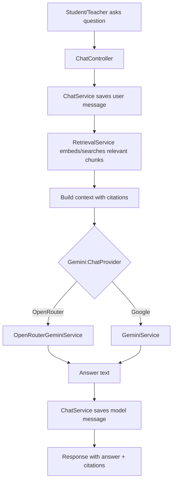

# System Overview

This document describes the current structure, runtime flow, configuration surface, and external integration points of the ASP.NET Core MVC system.

## Solution Structure

```text
GROUP1_Ass1.slnx
|-- MVC/                  Presentation layer
|   |-- Controllers/      MVC endpoints and HTTP boundary
|   |-- Views/            Razor UI
|   |-- ViewModels/       Form and page models
|   |-- Middlewares/      Global exception handling
|   |-- Workers/          Background document processing worker
|   `-- Program.cs        Dependency injection, auth, config, HTTP pipeline
|-- ServiceLayer/         Business logic layer
|   |-- Services/         Account, user, document, chat, Gemini, Qdrant logic
|   |-- Interfaces/       Service contracts
|   |-- DTOs/             Service boundary models
|   |-- Options/          Strongly-typed config models
|   `-- Resources/        Prompt/template resources
|-- DataAccessLayer/      Data access layer
|   |-- Models/           EF Core entity models and Prn222Context
|   |-- Repositories/     Repository abstractions/implementations
|   |-- UnitOfWork/       Unit of Work abstraction
|   `-- Scripts/          SQL compatibility/update scripts
|-- DocumentParser/       PDF/DOCX parsing and OCR utilities
`-- Test/                 xUnit tests
```

Dependency direction is one-way:



## Startup Flow

Main startup configuration lives in `MVC/Program.cs`.



Important startup behavior:

- `ConnectionStrings:DefaultConnection` is required. There is no local DB fallback in `Program.cs`.
- `Prn222Context.OnConfiguring` does not configure a provider. Database provider setup is centralized in DI.
- `UseAuthentication()` is called before `UseAuthorization()`.
- Admin seed runs only when `AdminSeed:Email` and `AdminSeed:Password` are present.

## Main HTTP Areas

### Authentication

Files:

- `MVC/Controllers/AccountController.cs`
- `ServiceLayer/Services/AccountService.cs`
- `ServiceLayer/Services/Pbkdf2PasswordHashService.cs`
- `MVC/Views/Account/Login.cshtml`
- `MVC/Views/Account/ChangePassword.cshtml`

Flow:



Change password:

- Requires an authenticated user.
- Uses current password verification.
- Hashes the new password with PBKDF2.
- Does not bind user id from the form; user id comes from the authenticated claim.

### Admin User Management

Files:

- `MVC/Controllers/AdminUsersController.cs`
- `MVC/Views/AdminUsers/Index.cshtml`
- `ServiceLayer/Services/UserManagementService.cs`
- `ServiceLayer/Services/SmtpEmailSender.cs`

Admin functions:

- Create student/teacher accounts.
- Import student accounts from CSV/XLSX.
- Block non-admin users.
- Reset password for student or teacher by email.

Password reset behavior:

- Admin submits an email.
- Service finds the account.
- Only `student` and `teacher` roles are resettable.
- `admin` accounts are blocked from this flow.
- Blocked accounts are not reset.
- Temporary password is generated server-side.
- Reset email is sent first.
- Password hash is saved only after the email send succeeds.

### Document Upload And Processing

Files:

- `MVC/Controllers/DocumentController.cs`
- `MVC/Workers/DocumentProcessingWorker.cs`
- `ServiceLayer/Services/DocumentService.cs`
- `ServiceLayer/Services/DocumentProcessor.cs`
- `ServiceLayer/Services/LocalStorageService.cs`
- `DocumentParser/Parsers/*`

Flow:



### Chat / RAG Answering

Files:

- `MVC/Controllers/ChatController.cs`
- `ServiceLayer/Services/ChatService.cs`
- `ServiceLayer/Services/RetrievalService.cs`
- `ServiceLayer/Services/OpenRouterGeminiService.cs`
- `ServiceLayer/Services/GeminiService.cs`

Flow:



## Configuration

Primary config file:

- `MVC/appsettings.json`

Development override:

- `MVC/appsettings.Development.json`

Runtime config is bound in `MVC/Program.cs` with options classes from `ServiceLayer/Options`.

### ConnectionStrings

```json
"ConnectionStrings": {
  "DefaultConnection": "..."
}
```

Used by:

- `MVC/Program.cs`
- `DataAccessLayer.Models.Prn222Context`

Notes:

- Required at startup.
- Should be supplied through deployment secrets, environment variables, or user secrets for real deployments.

Environment variable example:

```text
ConnectionStrings__DefaultConnection=...
```

### AdminSeed

```json
"AdminSeed": {
  "Email": "...",
  "Password": "..."
}
```

Used by:

- `MVC/Program.cs`
- `ServiceLayer.Services.UserManagementService.EnsureAdminUserAsync`

Behavior:

- If both values exist, startup ensures an admin account exists.
- Password is plaintext in configuration, then hashed by `Pbkdf2PasswordHashService`.
- If missing, admin seeding is skipped with a warning.

Environment variable examples:

```text
AdminSeed__Email=...
AdminSeed__Password=...
```

### SMTP

```json
"Smtp": {
  "Host": "smtp.gmail.com",
  "Port": 587,
  "EnableSsl": true,
  "Username": "...",
  "Password": "...",
  "FromAddress": "...",
  "FromName": "DocAssistant"
}
```

Options class:

- `ServiceLayer/Options/SmtpOptions.cs`

Used by:

- `ServiceLayer/Services/SmtpEmailSender.cs`
- `UserManagementService` when importing students or resetting passwords.

Behavior:

- Sends student welcome emails.
- Sends student/teacher password reset emails.
- Logs SMTP failure metadata without logging the SMTP password.

Environment variable examples:

```text
Smtp__Host=smtp.gmail.com
Smtp__Port=587
Smtp__EnableSsl=true
Smtp__Username=...
Smtp__Password=...
Smtp__FromAddress=...
Smtp__FromName=DocAssistant
```

### Upload

```json
"Upload": {
  "MaxFileSizeBytes": 20971520,
  "AllowedExtensions": [".pdf", ".docx"],
  "StorageRoot": "uploads"
}
```

Options class:

- `ServiceLayer/Options/UploadOptions.cs`

Used by:

- `DocumentService`
- `LocalStorageService`

### Chunking

```json
"Chunking": {
  "ChunkSize": 1400,
  "ChunkOverlap": 180,
  "Separators": ["\r\n", "\n\n", "\n", " ", ""]
}
```

Options class:

- `ServiceLayer/Options/ChunkingOptions.cs`

Used by:

- `RecursiveChunkingService`

### OCR

```json
"Ocr": {
  "EnableOcr": true,
  "Languages": "vie+eng",
  "Dpi": 300
}
```

Options class:

- `ServiceLayer/Options/OcrOptions.cs`

Used by document parsing/OCR behavior.

### Qdrant

```json
"Qdrant": {
  "Host": "localhost",
  "Port": 6334,
  "Https": false,
  "ApiKey": "",
  "CollectionName": "documents",
  "VectorSize": 3072,
  "RecreateCollectionOnVectorSizeMismatch": true
}
```

Options class:

- `ServiceLayer/Options/QdrantOptions.cs`

Used by:

- `MVC/Program.cs` to register `QdrantClient`
- `ServiceLayer/Services/QdrantService.cs`
- `ServiceLayer/Services/GeminiEmbeddingService.cs`

Notes:

- Qdrant gRPC default port is `6334`.
- `VectorSize` must match Gemini embedding dimensionality.
- `RecreateCollectionOnVectorSizeMismatch` can delete/recreate vectors for the configured collection.

### Gemini / OpenRouter

```json
"Gemini": {
  "ChatProvider": "OpenRouter",
  "ApiKey": "...",
  "ModelName": "gemini-2.5-flash",
  "EmbeddingModelName": "gemini-embedding-001",
  "OpenRouter": {
    "ApiKey": "...",
    "BaseUrl": "https://openrouter.ai/api/v1/chat/completions",
    "ModelName": "google/gemini-3.1-pro-preview",
    "SiteUrl": "",
    "AppName": "MVC RAG Assistant"
  },
  "SystemPrompt": "..."
}
```

Options class:

- `ServiceLayer/Options/GeminiOptions.cs`

## Where Gemini/OpenRouter Is Called

### Gemini Embeddings

File:

- `ServiceLayer/Services/GeminiEmbeddingService.cs`

Registered in:

- `MVC/Program.cs`

Call:

```csharp
_client.Models.EmbedContentAsync(
    model: _options.EmbeddingModelName,
    contents: input,
    config: new EmbedContentConfig
    {
        OutputDimensionality = _qdrantOptions.VectorSize
    },
    cancellationToken: cancellationToken);
```

Used by:

- `DocumentProcessor` when embedding document chunks.

Purpose:

- Converts text chunks into vectors.
- Vectors are inserted into Qdrant.

### Google Gemini Chat

File:

- `ServiceLayer/Services/GeminiService.cs`

Registered when:

- `Gemini:ChatProvider` is not `OpenRouter`
- `Gemini:ApiKey` is configured

Call:

```csharp
_client.Models.GenerateContentAsync(
    model: _options.ModelName,
    contents: new Content { Parts = new List<Part> { new Part { Text = contents } } },
    config: new GenerateContentConfig { SystemInstruction = null },
    cancellationToken: cancellationToken);
```

Purpose:

- Generates an answer directly through the Google Gemini API.

### OpenRouter Chat

File:

- `ServiceLayer/Services/OpenRouterGeminiService.cs`

Registered when:

- `Gemini:ChatProvider` is `OpenRouter`
- `Gemini:OpenRouter:ApiKey` is configured

Call:

```csharp
using var request = new HttpRequestMessage(HttpMethod.Post, endpoint)
{
    Content = JsonContent.Create(new OpenRouterChatRequest(
        openRouter.ModelName,
        new[]
        {
            new OpenRouterMessage("user", BuildPrompt(context, question))
        }))
};

request.Headers.Authorization =
    new AuthenticationHeaderValue("Bearer", openRouter.ApiKey);
```

Purpose:

- Sends an OpenAI-compatible chat completion request through OpenRouter.
- Uses `Gemini:OpenRouter:BaseUrl` and `Gemini:OpenRouter:ModelName`.

Fallback behavior:

- If chat API key is missing, DI registers `NoOpGeminiService`.
- `NoOpGeminiService` returns a development fallback response rather than calling a remote model.

## Security Notes

Known sensitive config keys:

- `ConnectionStrings:DefaultConnection`
- `AdminSeed:Password`
- `Smtp:Password`
- `Gemini:ApiKey`
- `Gemini:OpenRouter:ApiKey`
- `Qdrant:ApiKey` if used

These should not be committed with production values. Prefer:

- User secrets for local development.
- Environment variables for deployment.
- Secret manager in production infrastructure.

Current authentication/security behavior:

- Cookie authentication is configured in `MVC/Program.cs`.
- Protected controllers/actions use `[Authorize]`.
- Form POSTs use `[ValidateAntiForgeryToken]`.
- Passwords are hashed with PBKDF2.
- Password reset temporary passwords are only sent by email and are not displayed in the UI.
- Razor output remains encoded by default.

## Operational Checklist

Before running locally:

1. Configure `ConnectionStrings:DefaultConnection`.
2. Configure `AdminSeed` if automatic admin seeding is needed.
3. Configure `Smtp` if importing students or resetting passwords.
4. Configure `Gemini:ApiKey` for embeddings.
5. Configure either `Gemini:OpenRouter:ApiKey` or direct Gemini chat settings.
6. Start Qdrant with matching `VectorSize`.

Useful commands:

```powershell
dotnet build GROUP1_Ass1.slnx --no-restore
dotnet test GROUP1_Ass1.slnx --no-restore
dotnet run --project MVC/MVC.csproj
```

## Current High-Risk Hardcoded Values

At the time this document was created, `MVC/appsettings.json` contains real-looking secrets and credentials. Rotate and move them out of source before sharing or deployment:

- Database connection string.
- Admin seed password.
- SMTP Gmail app password.
- Gemini API key.
- OpenRouter API key.
